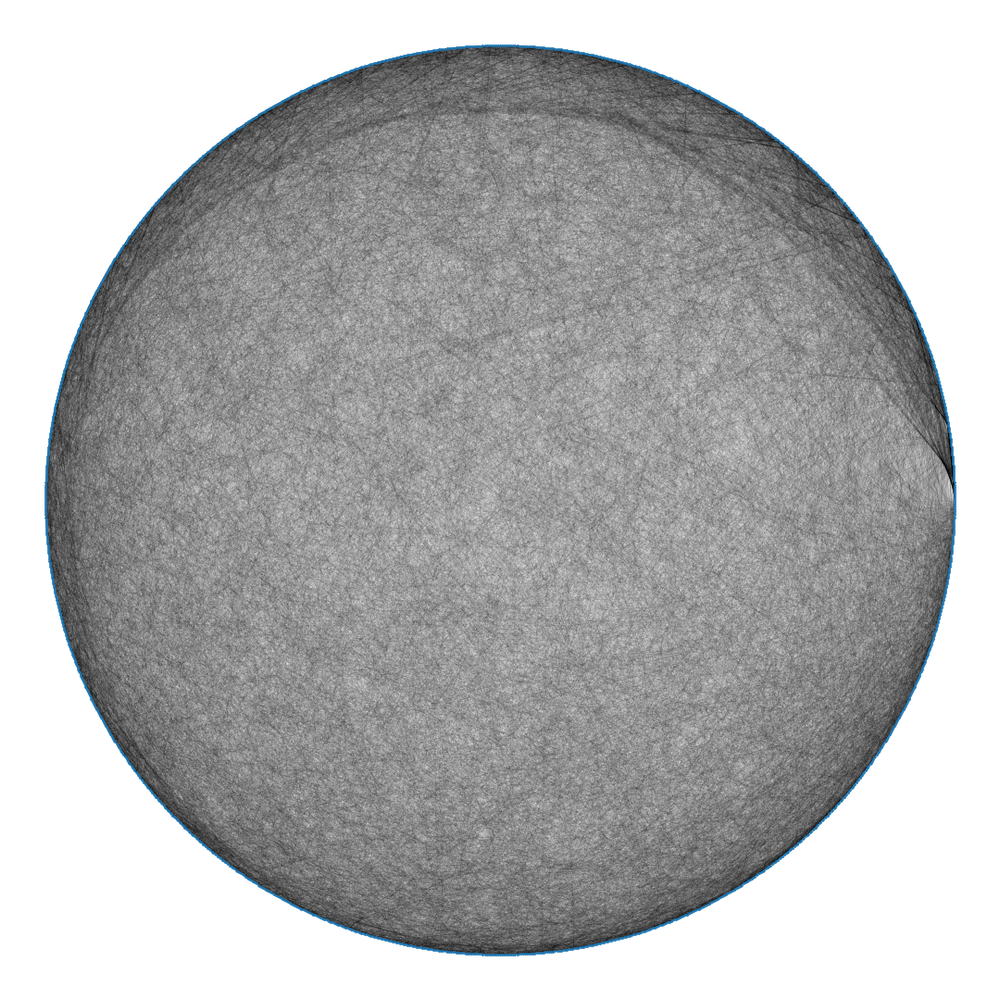

# **Agent-based SEIR** (AB-SEIR)
An [agent-based](https://en.wikipedia.org/wiki/Agent-based_model) approach to simulating [epidemiological compartmental models](https://en.wikipedia.org/wiki/Compartmental_models_in_epidemiology).

*In layman:* a simulation of an epidemic to analyze the effects of:
* various parameters on the total number of infected cases and deaths
* considering independent/individual nodes (agents) in each state, as opposed to performing operations population-wide
  * This is how S(E)IR models are traditionally researched

## **Installation**
### Prerequisites
* [Docker](https://www.docker.com/get-started/)
* [Node.js](https://nodejs.org/en/)
* [yarn](https://yarnpkg.com/getting-started/install) (recommended)

### Backend
In the root directory, run:

`docker compose up`

This starts up the following containers:
* [api](#api)
* [postgres](#database)
* [docs](#docs)

### Frontend
Run the following:
```bash
cd frontend
yarn
yarn start
```
1. Change directory to `/frontend` (from root).
2. Install dependencies with yarn.
3. Start the dev server.

If you prefer [npm](https://www.npmjs.com/), you can use `npm install` and `npm start` instead.

You can access the frontend at [localhost:3000](http://localhost:3000).

---

## Components

### **frontend**
Based off of [Create React App](https://github.com/facebook/create-react-app).

Code located at `/frontend`.

### **api**
[Django Rest Framework](https://www.django-rest-framework.org/) API that the frontend talks to to receive user/simulation/graph data and run simulations.

Accessible by default on port `8000`.

Code located at `/backend/api`.

Initially based off of [p8ul's DRF boilerplate](https://github.com/p8ul/django-rest-framework-boilerplate).

### **abseir**
Python package that does the actual simulation/graph-related calculations.

Code located at `/backend/abseir`.

### **database**
Postgres version 11.6 (docker image `postgres:11.6`).

### **docs**
API documentation. Accessible by default on port `8001`.

Code located at `/backend/docs`.

---

## pretty :)

Strogatz-Watts Graph with 1500 nodes, mean node degree 43, and diameter 3.
